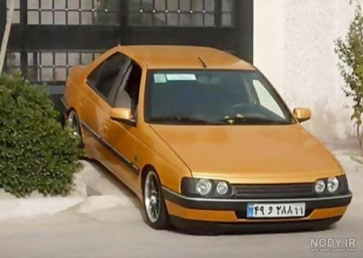

# Iranian LPR

## Iranian License Plate Recognition System

My first end-to-end Computer Vision project for detecting and recognizing Iranian vehicle license plates.

This project was my first serious step into Deep Learning and Computer Vision. The goal was to understand how a real-world AI pipeline is designed, trained, evaluated, and deployed.

The system detects vehicles, locates Iranian license plates, recognizes plate text using OCR, and provides results through a REST API.

---

# Project Overview

Automatic License Plate Recognition (ALPR) is one of the practical applications of Computer Vision in intelligent transportation systems, traffic monitoring, and smart city solutions.

In this project, I built a complete Computer Vision pipeline including:

- Data preparation
- Object detection model training
- Model evaluation
- Image processing
- Persian OCR
- API deployment

This repository contains the first version (v1.0) of the project.

---

# Pipeline Architecture

```
Input Image
     |
     ↓
Vehicle Detection
(YOLOv8)
     |
     ↓
Iranian License Plate Detection
(Custom YOLOv8 Model)
     |
     ↓
Plate Image Processing
     |
     ↓
Persian OCR Engine
     |
     ↓
FastAPI JSON Response
```

---

# Demo

Example input image:



---

# Features

- Vehicle detection using YOLOv8
- Iranian license plate detection using a custom trained model
- Persian license plate text recognition
- End-to-end inference pipeline
- FastAPI REST API
- Evaluation scripts for detection performance
- Modular project structure

---

# Technologies

- Python
- PyTorch
- Ultralytics YOLOv8
- OpenCV
- FastAPI
- OCR Engine
- Roboflow Dataset

---

# Model Evaluation

The plate detection model was evaluated using IoU-based matching.

## Validation Results

| Metric | Score |
|---|---:|
| Precision | 80.8% |
| Recall | 83.0% |
| F1 Score | 81.9% |

## Test Results

| Metric | Score |
|---|---:|
| Precision | 81.1% |
| Recall | 85.7% |
| F1 Score | 83.3% |

Evaluation includes:

- True Positive detections
- False Positive cases
- False Negative cases

---

# Installation & Usage

## 1. Clone the repository

```bash
git clone <repository-url>
cd iranian-lpr
```

## 2. Install dependencies

```bash
pip install -r requirements.txt
```

## 3. Run API server

```bash
python api/server.py
```

The API will start at:

```
http://127.0.0.1:8000
```

---

# API Usage

Send an image:

```bash
curl -X POST "http://127.0.0.1:8000/detect-plate" \
-F "file=@image.jpg"
```

Example response:

```json
{
  "message": "1 پلاک تشخیص داده شد",
  "plates": [
    {
      "plate_text": "۱۱ ایران - ۲۸۸ و ۴۹",
      "vehicle_type": "ماشین",
      "vehicle_bbox": [100,73,577,385],
      "plate_bbox": [304,256,405,286],
      "confidence": 0.70
    }
  ]
}
```

---

# Project Structure

```
iranian-lpr/

├── api/
│   └── server.py

├── models/
│   └── plate_detector.pt

├── src/
│   ├── detect_pipeline.py
│   ├── ocr_engine.py
│   ├── evaluate.py
│   ├── compare_sweep.py
│   ├── train_plate_v2.py
│   ├── prepare_plate_dataset.py
│   └── test_batch.py

├── data/
│   └── test_car.jpg

├── assets/
│   └── demo_input.jpg

├── requirements.txt
└── README.md
```

---

# Dataset

The license plate detection model was trained using an Iranian license plate dataset from Roboflow:

https://universe.roboflow.com/sultan-space/iranian-plate

The dataset is not included in this repository because of its size.

---

# Training (Optional)

If you want to retrain the plate detection model:

```bash
python src/prepare_plate_dataset.py

python src/train_plate_v2.py
```

---

# Current Limitations

Computer Vision models are highly dependent on input quality.

Current limitations:

- OCR accuracy decreases on blurry images
- Extreme viewing angles can reduce detection accuracy
- Very small license plates are harder to detect
- Low-light conditions can affect recognition quality

---

# Future Improvements

Possible improvements for future versions:

- Iranian vehicle make and model classification
- Improving Persian OCR accuracy with larger datasets
- Real-time video stream processing
- Traffic monitoring applications
- Docker deployment
- Model optimization for edge devices

---

# Motivation

This project was my first complete Computer Vision pipeline.

Throughout this project, I focused on understanding the complete workflow of an AI project:

- Preparing data
- Training models
- Evaluating results
- Building inference pipelines
- Deploying an API

This project helped me gain practical experience in Deep Learning and Computer Vision, and more improvements will be added in future versions.

---

# License

This project is released under the MIT License.